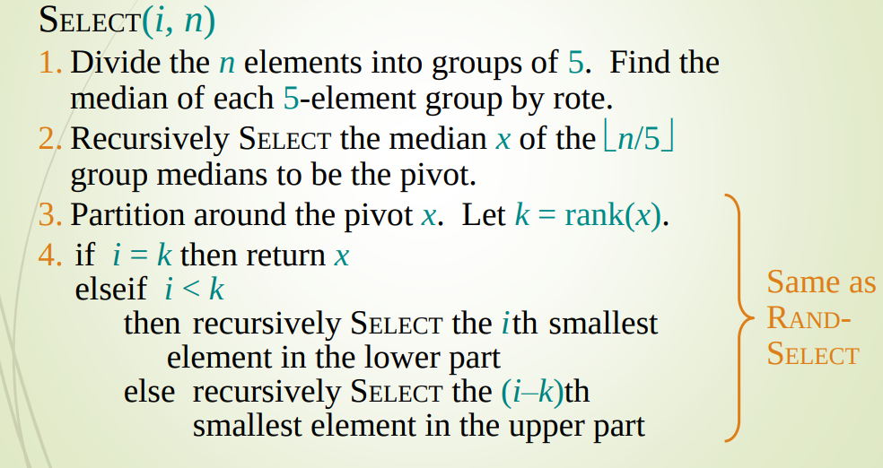

# Linear Select function

## Contributors
Marco Cioci, Francesco Rosnati, Luca Tramacere

## Purpose of the algorithm 
Find the i-th smallest element in an unsorted array, linearly time in the worst-case scenario.

## Steps

